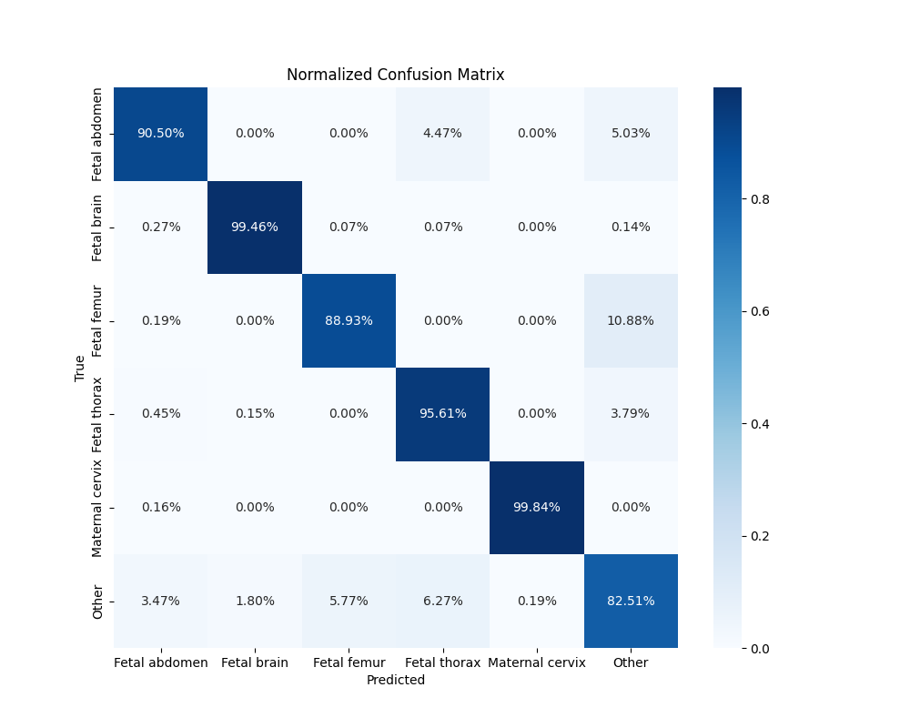
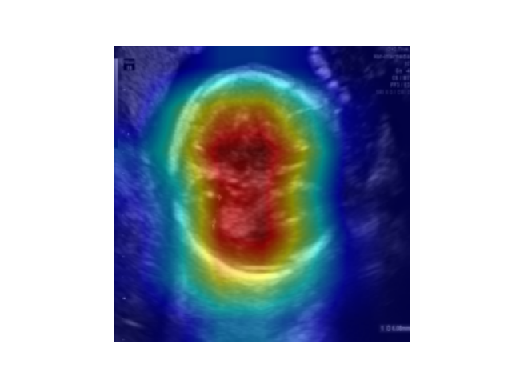

# 🎯 Fetal Ultrasound Plane Classification

[Français](#version-française) | [English](#english-version)

---

## Version Française

### 🏥 Contexte Médical

Lors des examens prénataux, les cliniciens doivent capturer des **plans anatomiques précis** (cerveau, abdomen, fémur, thorax…) pour mesurer la croissance fœtale et détecter des anomalies congénitales. Cette tâche est chronophage, subjective et dépendante de l'expérience de l'opérateur.

Ce projet automatise l'identification de ces plans à partir d'images échographiques brutes, une étape clé pour **standardiser les soins et réduire la variabilité inter-opérateurs**.

---

### 🚀 Points Clés du Projet

- **Architecture modulaire** : Code structuré en `.py` (dataset, model, train, evaluation) pour permettre les tests unitaires et le passage en production — pas un simple notebook.
- **Rigueur médicale du pipeline** : Augmentations anatomiquement correctes (pas de flip horizontal), WeightedRandomSampler pour le déséquilibre de classes, métriques recall-focused.
- **Explainability (Grad-CAM)** : Visualisation des zones d'intérêt pour valider cliniquement les décisions du modèle.
- **Error Analysis avancée** : Identification automatique des "pires prédictions" (haute confiance + erreur) pour comprendre les limites du modèle.
- **State-of-the-Art** : EfficientNet-B0 via `timm`, optimisé pour le compromis précision/vitesse (déployable sur tablette d'échographie).
- **Compatible Google Colab** : Le notebook détecte automatiquement l'environnement local ou Colab.

---

### 🛠️ Stack Technique

| Composant | Librairie |
|---|---|
| Framework DL | PyTorch (CUDA / MPS / CPU) |
| Modèle | `timm` — EfficientNet-B0 pretrained ImageNet |
| Explicabilité | `pytorch-grad-cam` |
| Métriques & Analyse | Scikit-learn · Seaborn · Pandas |
| Environnement | Python 3.10 · venv · compatible Colab |

---

## English Version

### 🏥 Medical Context

During prenatal screenings, clinicians must capture specific anatomical planes (brain, abdomen, femur, thorax…) to measure fetal growth and detect congenital anomalies. This task is time-consuming, subjective, and highly dependent on operator experience.

This project automates the identification of these planes from raw ultrasound images — a critical step toward **standardizing care and reducing inter-operator variability**.

---

### 🚀 Project Highlights

- **Modular architecture**: Structured `.py` code (dataset, model, train, evaluation) enabling unit tests and production deployment — not just a notebook.
- **Medical-grade pipeline**: Anatomically correct augmentations (no horizontal flip), WeightedRandomSampler for class imbalance, recall-focused metrics.
- **Explainability (Grad-CAM)**: Visualization of regions of interest for clinical validation of model decisions.
- **Advanced Error Analysis**: Automatic identification of "worst predictions" (high confidence + wrong) to understand model limitations.
- **State-of-the-Art**: EfficientNet-B0 via `timm`, optimized for the precision/speed trade-off (deployable on ultrasound tablets).
- **Google Colab compatible**: The notebook auto-detects local vs. Colab environment.

---

## 🚦 Installation & Usage

### 1. Environment
```bash
git clone https://github.com/Abd2k27/fetal-ultrasound-classification.git
cd fetal-ultrasound-classification

python3 -m venv venv
source venv/bin/activate  # Windows: venv\Scripts\activate

pip install -r requirements.txt
```

### 2. Data
Download the **[Fetal Planes DB](https://zenodo.org/record/3904280)** (Burgos-Artizzu et al., 2020) and place it as:
```
data/
├── Images/           # .png ultrasound images
└── FETAL_PLANES_DB_data.csv
```

### 3. Training (Local — Mac M1/M2/M3 or GPU)
```bash
python3 -m src.train
```
The code auto-detects the best available device (CUDA → MPS → CPU).

### ☁️ Google Colab
```python
!git clone https://github.com/Abd2k27/fetal-ultrasound-classification.git
%cd fetal-ultrasound-classification
!pip install -r requirements.txt
!python3 -m src.train
```

### 📊 Error Analysis Notebook
Once training is complete (`best_model.pth` generated):
```bash
jupyter notebook notebooks/01_Error_Analysis_and_Explainability.ipynb
```

---

## 📈 Résultats Réels / Actual Results

*EfficientNet-B0 · 15 époques · Test set officiel Fetal Planes DB (5 271 images)*

### Classification Report

| Classe / Class | Precision | Recall | F1-Score | Support |
|---|---|---|---|---|
| Fetal abdomen | 0.83 | 0.91 | 0.87 | 358 |
| **Fetal brain** | **0.98** | **0.99** | **0.99** | 1 472 |
| Fetal femur | 0.83 | 0.89 | 0.86 | 524 |
| Fetal thorax | 0.84 | 0.96 | 0.90 | 660 |
| **Maternal cervix** | **1.00** | **1.00** | **1.00** | 645 |
| Other | 0.93 | 0.83 | 0.87 | 1 612 |
| **Accuracy** | | | **0.92** | **5 271** |
| Macro avg | 0.90 | 0.93 | 0.91 | 5 271 |

### Confusion Matrix



### Grad-CAM — Explainability



---

## 🔬 Analyse Clinique des Résultats / Clinical Analysis

### Ce que le modèle maîtrise / What the model masters

- **Fetal brain (99.46% recall) & Maternal cervix (99.84%)** : Ces deux classes ont des morphologies très distinctives — la structure crânienne ovoïde et l'aspect fusiforme du col. Le modèle les reconnaît quasi-parfaitement.
- **Fetal thorax (95.61%)** : Bonne séparation grâce à la forme circulaire caractéristique et la présence du cœur fœtal.

### Zones de confusion et leur signification clinique / Confusion zones & their clinical meaning

- **Fetal femur → Other (10.88%)** : Le fémur est une structure linéaire fine. En dehors d'une angulation optimale, son aspect peut ressembler à d'autres structures osseuses ou à du bruit. C'est une confusion cliniquement attendue.
- **Fetal abdomen → Fetal thorax (4.47%)** : L'abdomen et le thorax sont tous deux des coupes transversales circulaires du tronc fœtal. La différence anatomique (estomac vs cœur) est subtile — exactement la source de variabilité inter-opérateurs que ce type de système cherche à réduire.
- **Other → classes définies (17.49% d'erreurs)** : "Other" est une classe fourre-tout, anatomiquement hétérogène. Certaines images "Other" ressemblent visuellement à des plans définis (acquisition hors-plan d'une structure reconnaissable). Le modèle ne peut pas distinguer une image "hors-plan" d'une image "en plan" si les structures visibles sont similaires — **limite fondamentale documentée**.

### Interprétation du Grad-CAM

Sur le cas le plus difficile (Other prédit comme Fetal brain, confiance 1.00), le Grad-CAM montre le modèle concentré sur la **structure ovoïde centrale** de l'image — exactement ce qu'un opérateur humain regarderait pour identifier un plan cérébral. L'erreur est cliniquement explicable : l'image "Other" présentait une structure qui ressemblait à une coupe crânienne. Le modèle regarde la **bonne zone**, mais se heurte à une **ambiguïté anatomique réelle**.

---

## 🔬 Méthodologie & Limites / Methodology & Limitations

### Data Splitting & Rigueur Médicale

Le dataset **Fetal Planes DB** est structuré par patient avec un split officiel Train/Test.

| Split | Méthode | Justification |
|---|---|---|
| **Test Set** | Split officiel patient-level | Performances mesurées sur des patientes totalement inconnues du modèle |
| **Validation Set** | Image-level (80/20 du train) | Compromis pratique — voir limite ci-dessous |

> **Limite documentée** : Dans un cadre de production clinique strict, le split Train/Validation devrait être **patient-level** pour éviter qu'une même patiente ne soit présente à la fois dans l'entraînement et la validation. Cette limite est volontairement documentée pour démontrer la compréhension des enjeux de **data leakage** en imagerie médicale — sujet critique pour la FDA/CE Mark.

### Augmentations & Contraintes Médicales

| Augmentation | Statut | Justification |
|---|---|---|
| `RandomAffine` (rotation 15°, translate 5%) | ✅ Utilisé | Simule les variations de positionnement de sonde |
| `ColorJitter` (brightness/contrast) | ✅ Utilisé | Simule les variations d'intensité de l'échographe |
| `RandomHorizontalFlip` | ❌ Exclu | L'orientation gauche/droite a une signification anatomique (position des organes, situs) |
| `RandomVerticalFlip` | ❌ Exclu | Haut/bas déterminé par la direction de la sonde |

---

*Built as a portfolio project to demonstrate interest in Medical Computer Vision. Dataset: [Fetal Planes DB](https://zenodo.org/record/3904280) — Burgos-Artizzu et al., Scientific Reports 2020.*
